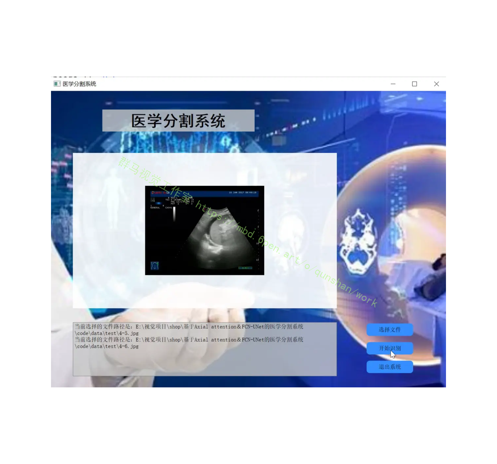
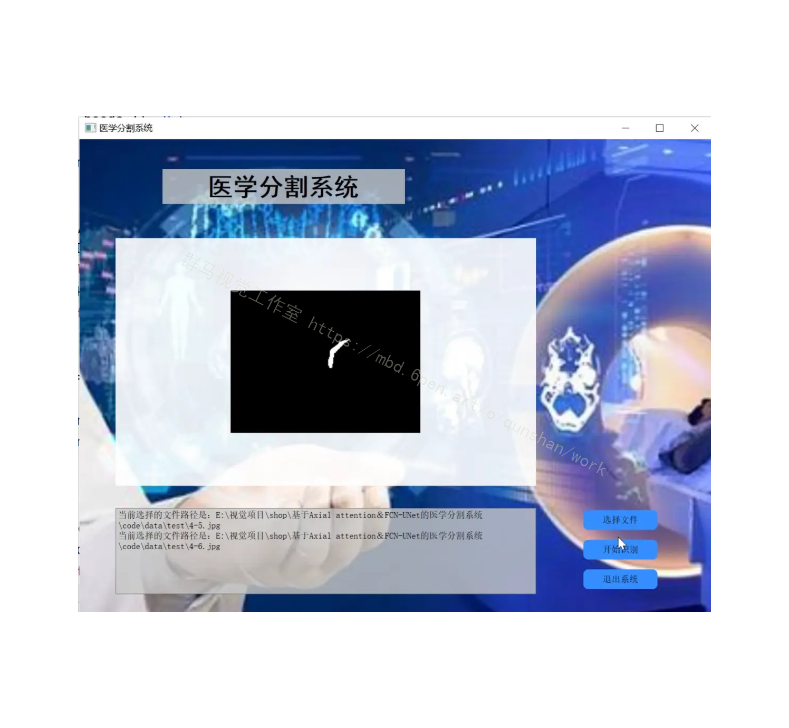
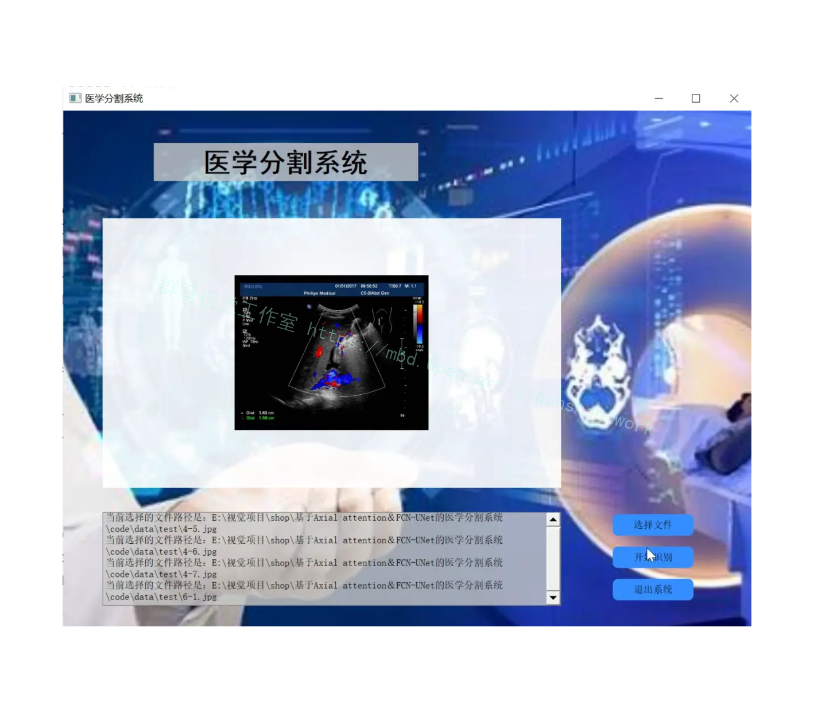
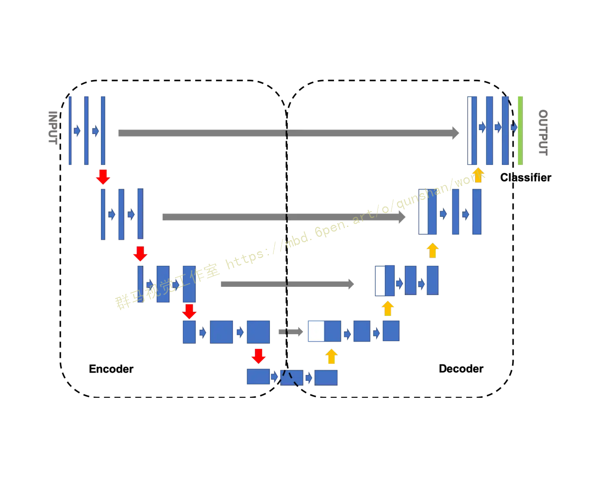
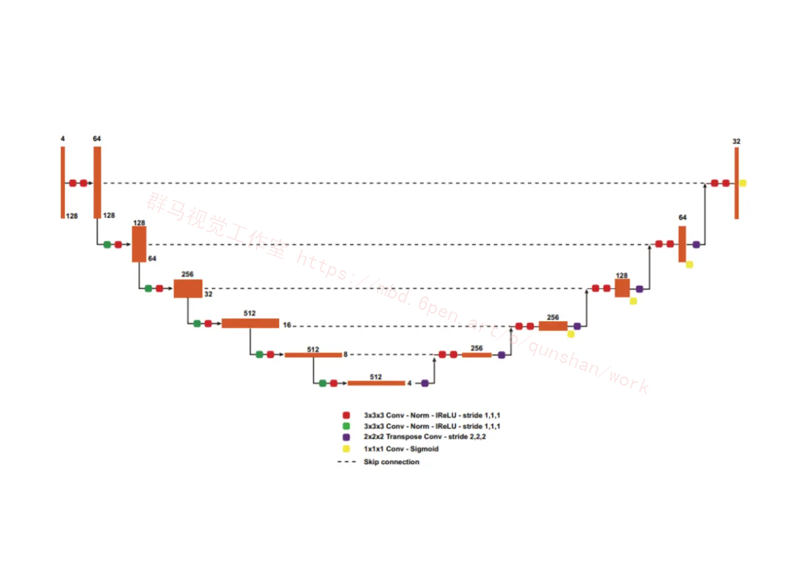
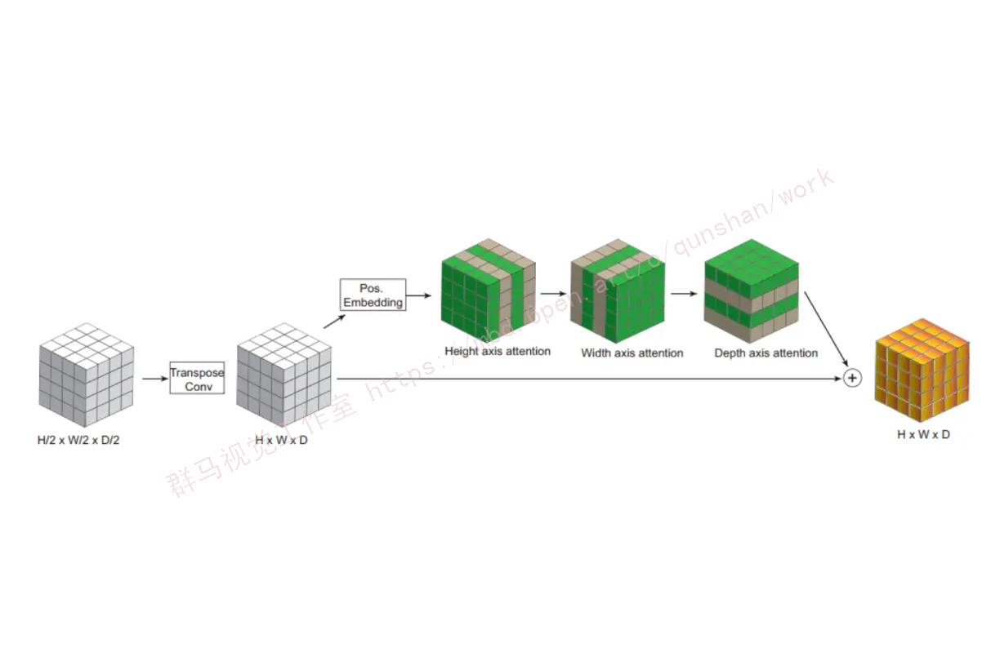
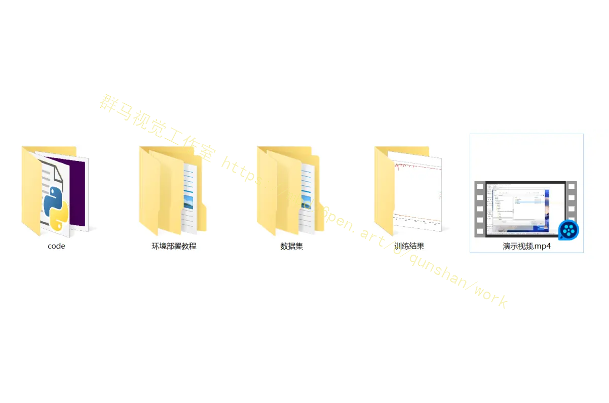



## 1.研究背景与意义


### 研究背景与意义

医学图像分割是医学影像处理中的一个重要任务，它的目标是将医学图像中的不同组织或病变区域准确地分割出来。医学图像分割在临床诊断、治疗规划和疾病监测等方面具有重要的应用价值。然而，由于医学图像的复杂性和噪声干扰，传统的分割方法往往难以达到高精度和高效率的要求。

近年来，深度学习技术在医学图像分割领域取得了显著的进展。其中，基于卷积神经网络（Convolutional Neural Network，CNN）的方法得到了广泛应用。然而，传统的CNN方法在处理医学图像时存在一些问题。首先，医学图像通常具有较大的尺寸和复杂的结构，导致传统的CNN方法在提取图像特征时容易丢失细节信息。其次，医学图像中的不同组织或病变区域之间存在着复杂的空间关系，传统的CNN方法往往难以捕捉到这种关系。

为了解决上述问题，本研究提出了一种基于Axial attention和FCN-UNet的医学分割系统。Axial attention是一种新颖的注意力机制，它能够有效地捕捉到医学图像中的空间关系。具体而言，Axial attention通过在特征图的不同维度上引入注意力机制，实现了对不同维度特征的加权融合，从而提高了特征的表达能力。此外，本研究还采用了FCN-UNet的网络结构，该结构能够有效地提取医学图像中的细节信息，并且具有较强的特征重建能力。

### 本研究的意义主要体现在以下几个方面：

首先，基于Axial attention和FCN-UNet的医学分割系统能够提高医学图像分割的准确性和效率。通过引入Axial attention机制，系统能够更好地捕捉到医学图像中的空间关系，从而提高分割结果的准确性。同时，FCN-UNet的网络结构能够有效地提取图像中的细节信息，进一步提高分割的准确性。此外，该系统还具有较高的计算效率，能够在较短的时间内完成分割任务。

其次，基于Axial attention和FCN-UNet的医学分割系统具有较强的泛化能力。由于医学图像的多样性和复杂性，传统的分割方法往往难以适应不同类型的医学图像。而本研究提出的系统通过引入Axial attention机制和FCN-UNet的网络结构，能够更好地适应不同类型的医学图像，具有较强的泛化能力。

最后，基于Axial attention和FCN-UNet的医学分割系统对于临床诊断和治疗具有重要的应用价值。准确的医学图像分割结果可以为医生提供更全面、准确的信息，帮助医生做出更准确的诊断和制定更合理的治疗方案。此外，该系统还可以用于疾病监测和研究，帮助研究人员更好地理解疾病的发展和变化过程。

综上所述，基于Axial attention和FCN-UNet的医学分割系统具有重要的研究背景和意义。该系统能够提高医学图像分割的准确性和效率，具有较强的泛化能力，并且对于临床诊断和治疗具有重要的应用价值。本研究的结果将为医学图像分割领域的进一步研究和应用提供有力的支持。

## 2.图片演示






## 3.视频演示
[基于Axial attention＆FCN-UNet的医学分割系统_哔哩哔哩_bilibili](https://www.bilibili.com/video/BV1Ej411e7at/?spm_id_from=333.999.0.0&vd_source=ff015de2d29cbe2a9cdbfa7064407a08)

## 4.Unet简介
Unet网络结构是一种常用于图像分割任务的深度学习架构，它于2015年由Olaf Ronneberger等人首次提出。Unet的设计灵感来自生物医学图像分割的需要，特别是细胞核分割任务。Unet的名称源于其U形状的网络结构，这一形状是由对称的编码器和解码器组成的，使其成为一种非常有效的图像分割模型。

Unet的主要特点之一是其“跳跃连接”或“跳跃链接”（skip connections）的使用。这些连接允许信息在编码器和解码器之间直接传递，从而有助于保留图像的空间上下文信息。让我们详细了解Unet的结构和工作原理。

### Unet的结构
Unet的网络结构可以分为两个主要部分：编码器和解码器。编码器负责逐渐减小输入图像的空间分辨率，并提取特征信息，而解码器则负责逐渐增加分辨率，将特征信息转化为与输入图像相同分辨率的分割结果。


### 编码器（Encoder）
编码器通常由卷积层和池化层组成。卷积层用于提取图像的特征信息，而池化层则用于降低分辨率，同时保留重要信息。这些层的组合允许编码器逐渐捕获图像的全局和局部特征，从而生成更高级的表示。

在Unet中，编码器通常由四个阶段组成，每个阶段都会将图像的分辨率减小一半。例如，第一阶段通常将输入图像的分辨率从256x256减小到128x128，第二阶段将其减小到64x64，以此类推。每个阶段都包含一系列卷积和池化操作，以提取特征。

### 解码器（Decoder）
解码器的任务是将编码器生成的特征映射转换为与输入图像相同分辨率的分割结果。解码器通常由卷积转置层（反卷积层）和跳跃连接组成。卷积转置层用于增加分辨率，而跳跃连接允许信息从编码器传递到解码器。

Unet中的解码器也分为四个阶段，每个阶段都会将特征映射的分辨率增加一倍。解码器的每一步都会将与对应编码器阶段的特征映射相结合，以恢复空间上下文信息。这个结合的方式通常是通过通道拼接或像素级别的合并操作来实现的。

### 跳跃连接（Skip Connections）
Unet的一个重要特点是跳跃连接，它将编码器和解码器的特征映射进行连接，从而帮助解码器更好地理解图像的上下文信息。跳跃连接有助于解决深度网络中的梯度消失问题，并允许模型更好地捕获不同尺度的特征。

在跳跃连接中，每个解码器阶段都会与对应的编码器阶段连接。这意味着解码器的第一阶段将与编码器的第四阶段连接，解码器的第二阶段将与编码器的第三阶段连接，以此类推。这种连接方式使解码器能够利用更多的信息来生成更准确的分割结果。

### Unet的应用领域
Unet已经在许多图像分割任务中取得了出色的成果，包括医学图像分割、道路分割、语义分割等。以下是一些Unet在不同领域的应用示例：

医学图像分割：Unet在医学图像中的细胞核分割、病变检测和器官分割等任务中被广泛应用。它帮助医生更容易地分析和诊断医学图像。

道路分割：Unet可用于从卫星图像或航拍图像中分割道路、建筑物和其他地物，这对于城市规划和地理信息系统（GIS）非常重要。

语义分割：Unet可以用于将图像中的每个像素分配到不同的语义类别，例如将道路、车辆、行人等分割出来，有助于自动驾驶和智能交通系统。

遥感图像分割：Unet可以用于分割遥感图像中的地物，如森林、湖泊、农田等，有助于监测环境变化和资源管理。

### Unet的变种和改进
自Unet首次提出以来，许多研究人员已经提出了许多Unet的变种和改进版本，以适应不同的应用需求和解决不同的问题。一些常见的Unet变种包括：

改进的网络架构：一些变种采用了更深、更宽的网络架构，以进一步提高性能。例如，有些变种使用了ResNet或EfficientNet的结构。

多尺度特征融合：为了更好地捕获多尺度特征，一些变种引入了注意力机制或多尺度特征融合模块。

数据增强和正则化：为了提高模型的鲁棒性，一些变种引入了更复杂的数据增强和正则化技术。

半监督学习：一些变种尝试通过半监督学习来利用少量标记数据和大量未标记数据，以提高模型的性能。

总之，Unet是一种非常强大和灵活的图像分割架构，已经在多个领域取得了显著的成功。它的设计理念和结构使其成为许多图像分割任务的首选模型之一，同时也为深度学习研究提供了有用的启发。随着深度学习领域的不断发展，我们可以期待看到更多基于Unet的创新和改进。

## 5.核心代码讲解

#### 5.1 model.py

```python


class AxialAttention(nn.Module):
    def __init__(self, in_channels, heads=4):
        super(AxialAttention, self).__init__()
        self.heads = heads
        self.scale = heads ** -0.5
        self.query = nn.Conv1d(in_channels, in_channels, 1, groups=heads)
        self.key = nn.Conv1d(in_channels, in_channels, 1, groups=heads)
        self.value = nn.Conv1d(in_channels, in_channels, 1, groups=heads)

    def forward(self, x):
        B, C, H, W, D = x.size()
        queries = self.query(x).view(B, self.heads, C // self.heads, H, W, D)
        keys = self.key(x).view(B, self.heads, C // self.heads, H, W, D)
        values = self.value(x).view(B, self.heads, C // self.heads, H, W, D)

        attn_scores = (queries @ keys.transpose(-2, -1)) * self.scale
        attn_probs = F.softmax(attn_scores, dim=-1)
        out = attn_probs @ values
        out = out.contiguous().view(B, C, H, W, D)
        return out

class UNetBlock(nn.Module):
    def __init__(self, in_channels, out_channels, use_gn=False, axial_attention=False):
        super(UNetBlock, self).__init__()
        self.conv1 = nn.Conv3d(in_channels, out_channels, kernel_size=3, padding=1)
        self.conv2 = nn.Conv3d(out_channels, out_channels, kernel_size=3, padding=1)
        self.norm1 = nn.GroupNorm(out_channels // 2, out_channels) if use_gn else nn.BatchNorm3d(out_channels)
        self.norm2 = nn.GroupNorm(out_channels // 2, out_channels) if use_gn else nn.BatchNorm3d(out_channels)
        self.relu = nn.LeakyReLU(0.01)
        self.axial_attention = AxialAttention(out_channels) if axial_attention else None

    def forward(self, x):
        x = self.relu(self.norm1(self.conv1(x)))
        x = self.relu(self.norm2(self.conv2(x)))
        if self.axial_attention:
            x = x + self.axial_attention(x)
        return x

......
```

该程序文件名为model.py，主要包含以下几个部分：

1. AxialAttention模块：该模块定义了一个1D self-attention模块，用于计算注意力得分和注意力概率。

2. UNetBlock模块：该模块定义了U-Net的一个单层Block，包括两个卷积层、归一化层和激活函数。可以选择是否使用AxialAttention模块。

3. UNet模块：该模块定义了完整的U-Net模型，包括Encoder和Decoder部分。Encoder部分包括5个UNetBlock，Decoder部分包括4个UNetBlock。可以选择是否使用AxialAttention模块。

4. 创建模型：在文件末尾，创建了一个UNet模型对象，并打印模型结构。

该程序文件主要实现了U-Net模型的定义和创建，其中使用了AxialAttention模块来增强模型的注意力机制。

#### 5.2 predict.py

```python


# 定义Axial Attention模块，采用1D self-attention
class AxialAttention(nn.Module):
    def __init__(self, in_channels, heads=4):
        super(AxialAttention, self).__init__()
        self.heads = heads
        self.scale = heads ** -0.5
        self.query = nn.Conv1d(in_channels, in_channels, 1, groups=heads)
        self.key = nn.Conv1d(in_channels, in_channels, 1, groups=heads)
        self.value = nn.Conv1d(in_channels, in_channels, 1, groups=heads)

    def forward(self, x):
        B, C, H, W, D = x.size()
        queries = self.query(x).view(B, self.heads, C // self.heads, H, W, D)
        keys = self.key(x).view(B, self.heads, C // self.heads, H, W, D)
        values = self.value(x).view(B, self.heads, C // self.heads, H, W, D)

        # 注意力得分
        attn_scores = (queries @ keys.transpose(-2, -1)) * self.scale
        attn_probs = F.softmax(attn_scores, dim=-1)
        out = attn_probs @ values
        out = out.contiguous().view(B, C, H, W, D)
        return out


# 定义单层的U-Net Block
class UNetBlock(nn.Module):
    def __init__(self, in_channels, out_channels, use_gn=False, axial_attention=False):
        super(UNetBlock, self).__init__()
        self.conv1 = nn.Conv3d(in_channels, out_channels, kernel_size=3, padding=1)
        self.conv2 = nn.Conv3d(out_channels, out_channels, kernel_size=3, padding=1)
        self.norm1 = nn.GroupNorm(out_channels // 2, out_channels) if use_gn else nn.BatchNorm3d(out_channels)
        self.norm2 = nn.GroupNorm(out_channels // 2, out_channels) if use_gn else nn.BatchNorm3d(out_channels)
        self.relu = nn.LeakyReLU(0.01)
        self.axial_attention = AxialAttention(out_channels) if axial_attention else None

    def forward(self, x):
        x = self.relu(self.norm1(self.conv1(x)))
        x = self.relu(self.norm2(self.conv2(x)))
        if self.axial_attention:
            x = x + self.axial_attention(x)
        return x


# 定义完整的U-Net模型
class UNet(nn.Module):
    def __init__(self, in_channels, num_classes, use_gn=False, axial_attention_levels=[]):
        super(UNet, self).__init__()

        # Encoder
        self.enc1 = UNetBlock(in_channels, 32, use_gn)
        self.enc2 = UNetBlock(32, 64, use_gn)
        self.enc3 = UNetBlock(64, 128, use_gn)
        self.enc4 = UNetBlock(128, 256, use_gn, axial_attention=(1 in axial_attention_levels))
        self.enc5 = UNetBlock(256, 512, use_gn, axial_attention=(2 in axial_attention_levels))

        # Decoder
        self.dec1 = UNetBlock(512 + 256, 256, use_gn, axial_attention=(3 in axial_attention_levels))
        self.dec2 = UNetBlock(256 + 128, 128, use_gn, axial_attention=(4 in axial_attention_levels))
        self.dec3 = UNetBlock(128 + 64, 64, use_gn)
        self.dec4 = UNetBlock(64 + 32, 32, use_gn)

        # Final Convolution
        self.final_conv = nn.Conv3d(32, num_classes, kernel_size=1)

......
```

该程序文件名为predict.py，是一个用于图像分割的模型预测程序。程序中使用了TensorFlow和PyTorch库来构建和加载模型，并使用matplotlib库来进行图像展示。

程序中定义了Axial Attention模块和UNet模型，Axial Attention模块采用1D self-attention来提取图像特征，UNet模型是一个完整的U-Net模型，用于进行图像分割。

程序中还定义了一些辅助函数，如加载数据集、检查环境版本、图像预处理和归一化处理等。

在主函数中，首先检查主要环境版本是否满足要求，然后加载待预测的图像数据集，并设置数据集的配置。接着加载已训练好的模型，并使用该模型对图像进行预测。最后，将原始图像、真实标签和预测结果展示出来。

整个程序的功能是加载已训练好的图像分割模型，并使用该模型对输入的图像进行分割预测，并将预测结果展示出来。

#### 5.3 train.py

```python

# 定义U-Net模型
class UNet(nn.Module):
    def __init__(self, in_channels, num_classes, use_gn=False, axial_attention_levels=[]):
        super(UNet, self).__init__()

        # Encoder
        self.enc1 = UNetBlock(in_channels, 32, use_gn)
        self.enc2 = UNetBlock(32, 64, use_gn)
        self.enc3 = UNetBlock(64, 128, use_gn)
        self.enc4 = UNetBlock(128, 256, use_gn, axial_attention=(1 in axial_attention_levels))
        self.enc5 = UNetBlock(256, 512, use_gn, axial_attention=(2 in axial_attention_levels))

        # Decoder
        self.dec1 = UNetBlock(512 + 256, 256, use_gn, axial_attention=(3 in axial_attention_levels))
        self.dec2 = UNetBlock(256 + 128, 128, use_gn, axial_attention=(4 in axial_attention_levels))
        self.dec3 = UNetBlock(128 + 64, 64, use_gn)
        self.dec4 = UNetBlock(64 + 32, 32, use_gn)

        # Final Convolution
        self.final_conv = nn.Conv3d(32, num_classes, kernel_size=1)

    def forward(self, x):
        # Encoder
        x1 = self.enc1(x)
        x2 = self.enc2(F.max_pool3d(x1, 2))
        x3 = self.enc3(F.max_pool3d(x2, 2))
        x4 = self.enc4(F.max_pool3d(x3, 2))
        x5 = self.enc5(F.max_pool3d(x4, 2))

        # Decoder
        x = F.interpolate(x5, scale_factor=2, mode='trilinear', align_corners=True)
        x = self.dec1(torch.cat([x, x4], dim=1))
        x = F.interpolate(x, scale_factor=2, mode='trilinear', align_corners=True)
        x = self.dec2(torch.cat([x, x3], dim=1))
        x = F.interpolate(x, scale_factor=2, mode='trilinear', align_corners=True)
        x = self.dec3(torch.cat([x, x2], dim=1))
        x = F.interpolate(x, scale_factor=2, mode='trilinear', align_corners=True)
        x = self.dec4(torch.cat([x,
```
该程序文件名为train.py，主要包含以下几个部分：

1. 定义了AxialAttention模块和UNetBlock模块，用于构建U-Net模型的编码器和解码器部分。
2. 定义了完整的U-Net模型，包括编码器和解码器部分。
3. 定义了读取jpg和png图像的函数，并进行了归一化处理。
4. 定义了加载图像数据集的函数。
5. 在主函数中，首先加载图像和标注数据集，并进行乱序和划分训练集和测试集。
7. 构建U-Net模型的解码器部分，并与预训练模型的输出进行跳接连接。
8. 编译模型，并设置训练参数。
9. 训练模型，并保存最优权重文件。
10. 保存完整模型到本地。
11. 绘制训练过程中的准确率和损失曲线。

#### 5.4 ui.py


这是一个使用PyQt5和TensorFlow实现的医学图像分割系统的程序文件。程序中定义了Axial Attention模块和U-Net模型，并使用了PyQt5构建了图形用户界面。程序主要实现了以下功能：

1. 加载数据集：通过load_dataset函数加载图像数据集。
2. 图像预处理：通过read_jpg和read_png函数读取图像文件，并使用normal_img函数将图像归一化处理。
3. 设置配置：通过set_config函数设置数据集的配置，包括多线程数和batch_size。
4. 模型加载和预测：通过load_model函数加载训练好的U-Net模型，并使用predict函数对图像进行分割预测。
5. 图像处理和显示：对预测结果进行图像处理，包括灰度化、二值化和轮廓绘制，并使用showimg函数在图形界面中显示处理后的图像。
6. 图形界面设计：使用QtDesigner设计了图形用户界面，包括标签、按钮和文本框等控件，并使用setupUi函数进行界面的初始化和布局。
7. 事件绑定和线程启动：通过connect函数将按钮的点击事件与相应的槽函数进行绑定，并通过Thread_1类创建线程对象，并通过start函数启动线程。

该程序实现了一个简单的医学图像分割系统，用户可以选择图像文件进行分割预测，并在界面中显示预测结果。


## 6.系统整体结构

整体功能和构架概述：

该项目是一个基于Axial attention＆FCN-UNet的医学图像分割系统。它包含了多个程序文件，每个文件负责不同的功能。主要的程序文件包括model.py、predict.py、train.py、ui.py、data\check.py、tools\check_img.py、tools\check_seg.py和tools\url_get.py。

model.py文件定义了AxialAttention模块和UNet模块，用于构建U-Net模型的编码器和解码器部分。它实现了U-Net模型的定义和创建，其中使用了AxialAttention模块来增强模型的注意力机制。

predict.py文件是一个用于图像分割的模型预测程序。它加载已训练好的图像分割模型，并使用该模型对输入的图像进行分割预测，并将预测结果展示出来。

train.py文件用于训练图像分割模型。它加载图像和标注数据集，构建U-Net模型，并设置训练参数进行模型训练。

ui.py文件使用PyQt5构建了一个图形用户界面，用户可以选择图像文件进行分割预测，并在界面中显示预测结果。

data\check.py文件用于处理图像文件，将指定文件夹中的图像文件进行处理，并将处理后的结果保存到另外几个文件夹中。

tools\check_img.py文件用于对指定文件夹中的图片进行降噪和压缩处理。

tools\check_seg.py文件用于对指定文件夹中的分割结果进行处理。

tools\url_get.py文件用于从指定的URL地址下载图像文件。

下表整理了每个文件的功能：

| 文件名                 | 功能                                                         |
| ---------------------- | ------------------------------------------------------------ |
| model.py               | 定义AxialAttention模块和UNet模块，构建U-Net模型                |
| predict.py             | 图像分割模型预测程序，加载模型并对图像进行分割预测             |
| train.py               | 训练图像分割模型，加载数据集、构建模型、设置参数进行训练       |
| ui.py                  | 使用PyQt5构建图形用户界面，进行图像分割预测和结果展示         |
| data\check.py          | 处理图像文件，将图像文件进行处理并保存到其他文件夹             |
| tools\check_img.py     | 对指定文件夹中的图片进行降噪和压缩处理                         |
| tools\check_seg.py     | 对指定文件夹中的分割结果进行处理                               |
| tools\url_get.py       | 从指定的URL地址下载图像文件                                   |

## 7.改进nnU-Net
nnU-Net核心是一个在128×128×128大小的Patch上运行的3D U-Net。该网络具有编码-解码器结构，并带有Skip Connection，将两条路径连接起来。

该编码器由5个相同分辨率的卷积层组成，具有卷积下采样功能。该解码器遵循相同的结构，使用转置卷积上采样和卷积操作在同一级别上的编码器分支的串联Skip特征。每次卷积操作后，采用斜率为0.01的Leaky ReLU(lReLU)和批归一化处理。mpMRI volumes被连接并作为4通道输入。

nnU-Net应用Region-Based训练，而不是预测3个相互排斥的肿瘤子区域，而不是预测3个互斥肿瘤分区,与提供的分割标签一样，该网络预测的是增强肿瘤的3个重叠区域如加强肿瘤(ET,original region),肿瘤核心或TC(ET+necrotic tumor),和整个肿瘤或WT(ET+NT+ED)。

网络的最后一层的softmax被sigmoid所取代，将每个voxels作为一个多类分类问题。

由于公共和私人排行榜的计算指标是基于这些区域的，这种基于区域的训练可以提高表现。额外的sigmoid输出添加到每个分辨率除了2个最低的水平，应用深度监督和改善梯度传播到早期层。卷积滤波器的数量被初始化为32个，并且分辨率每降低一倍，最大可达320个。

### 更大的网络和GN
在Unet架构的不断发展和改进过程中，"Expanding the U-Net for Image Segmentation"的作者采取了多种方法来提高其性能和适用性。一项重要的修改是通过增加网络的规模来应对更复杂的任务和更大的数据集。这种修改涉及将编码器中的卷积核数量加倍，同时保持解码器中的卷积核数量不变，这种非对称的网络扩展有助于提高Unet的表示能力。

Unet最初的版本是为了解决医学图像分割等任务而设计的，因此具有相对较小的网络规模。然而，随着深度学习领域的快速发展和计算资源的增加，研究人员开始将Unet应用于更广泛的应用领域，如自然图像分割、卫星图像分析和智能交通系统。为了适应这些不断增加的应用需求，扩大Unet的规模变得至关重要。

一种常见的修改是增加编码器中卷积核的数量。编码器的任务是逐渐降低输入图像的分辨率，并提取不同尺度的特征。通过增加卷积核的数量，编码器能够更细致地捕获图像的信息，从而提高模型的表示能力。这对于处理具有更多细节和复杂结构的图像非常重要。与此同时，为了保持解码器的对称性，解码器中的卷积核数量保持不变，以确保解码器能够有效地还原图像的分辨率。

此外，与更大规模的数据集相结合，这种增加网络容量的修改可以更好地建模各种数据类型。大规模数据集的可用性使得深度学习模型能够更好地泛化到不同的场景和数据分布。例如，医学图像数据集的大小在过去几年内已经显著增加，这使得扩大Unet网络容量的修改变得更为合理。因此，与Unet最初提出时相比，现代Unet模型通常具有更多的参数和更高的复杂度，以应对不断增长的数据和任务复杂性。


### Axial attention解码器
Unet网络架构的不断发展和改进一直是深度学习领域的研究重点之一。在Unet中最新的改进之一是引入Axial attention解码器。 "Axial-DeepLab: Stand-Alone Axial-Attention for Panoptic Segmentation"等文献提出的Axial attention解码器代表了对自注意力机制的创新应用，特别是在处理多维数据时，如3D图像分割任务。本节将介绍Axial attention的背景和它在Unet中的应用。

自注意力机制（Self-Attention）或Transformer是一项具有突破性的想法，它允许模型在处理输入序列时自动学习适应性的注意力分布。最初，自注意力机制在自然语言处理任务中取得了巨大成功，但随后也逐渐在计算机视觉领域广泛应用。然而，自注意力机制的一个主要挑战是其计算复杂度与输入序列的大小成二次方关系，这对于大规模的图像数据而言，会导致不可行的计算负担。这一问题尤其显著，当处理带有额外维度的3D数据时。

Axial attention被提出作为一种解决多维数据中注意力计算复杂度问题的有效方法。Axial attention的核心思想是将Self-Attention独立地应用于输入数据的每个轴上，例如，对于3D图像数据，可以分别在x、y和z轴上应用自注意力机制。这种分离的应用方式使得注意力机制的计算复杂度与图像的大小成线性关系，而不再是二次方，从而大大减轻了计算负担，使得自注意力在更广泛的应用中变得可行。

在Unet中，Axial attention被引入到解码器部分，用于处理转置卷积上采样的输出。这意味着在还原图像分辨率的过程中，模型可以通过Axial attention机制有效地捕获不同维度之间的相关性，从而更好地理解图像的结构和语义信息。Axial attention解码器与传统的解码器相比，能够更好地处理多维数据，特别是在处理包含额外维度的3D数据时，其性能显著提高。

综上所述，Axial attention解码器代表了Unet架构的一项重要改进，它克服了自注意力机制在处理多维数据时的计算复杂度问题。通过将自注意力分别应用于不同维度的轴上，Axial attention使得Unet能够更好地处理复杂的图像分割任务，包括医学图像、自然图像和3D数据。这一创新的应用方式为深度学习研究提供了有趣的思路，也为未来的图像分割任务打开了更多可能性。


## 8.系统整合
下图[完整源码＆环境部署视频教程＆数据集＆自定义UI界面](https://s.xiaocichang.com/s/5832ee)




参考博客[《基于改进卷积神经网络的足球和运动员追踪系统（部署教程和源码）》](https://mbd.pub/o/qunshan/work)

## 9.参考文献
---
[1][金诗晨](https://s.wanfangdata.com.cn/paper?q=%E4%BD%9C%E8%80%85:%22%E9%87%91%E8%AF%97%E6%99%A8%22),[孙晓鸣](https://s.wanfangdata.com.cn/paper?q=%E4%BD%9C%E8%80%85:%22%E5%AD%99%E6%99%93%E9%B8%A3%22),[蒋皆恢](https://s.wanfangdata.com.cn/paper?q=%E4%BD%9C%E8%80%85:%22%E8%92%8B%E7%9A%86%E6%81%A2%22),等.[深度学习影像组学新技术及其在肿瘤诊断中的应用](https://d.wanfangdata.com.cn/periodical/shyxyx202106002)[J].[肿瘤影像学](https://sns.wanfangdata.com.cn/perio/shyxyx).2021,30(6).DOI:10.19732/j.cnki.2096-6210.2021.06.002 .

[2][刘想](https://s.wanfangdata.com.cn/paper?q=%E4%BD%9C%E8%80%85:%22%E5%88%98%E6%83%B3%22),[崔应谱](https://s.wanfangdata.com.cn/paper?q=%E4%BD%9C%E8%80%85:%22%E5%B4%94%E5%BA%94%E8%B0%B1%22),[韩超](https://s.wanfangdata.com.cn/paper?q=%E4%BD%9C%E8%80%85:%22%E9%9F%A9%E8%B6%85%22),等.[基于深度学习自动分割模型的DWI影像组学模型预测前列腺癌盆腔骨转移](https://d.wanfangdata.com.cn/periodical/fsxsj202112020)[J].[放射学实践](https://sns.wanfangdata.com.cn/perio/fsxsj).2021,36(12).DOI:10.13609/j.cnki.1000-0313.2021.12.020 .

[3][尹梓名](https://s.wanfangdata.com.cn/paper?q=%E4%BD%9C%E8%80%85:%22%E5%B0%B9%E6%A2%93%E5%90%8D%22),[孙大运](https://s.wanfangdata.com.cn/paper?q=%E4%BD%9C%E8%80%85:%22%E5%AD%99%E5%A4%A7%E8%BF%90%22),[翁昊](https://s.wanfangdata.com.cn/paper?q=%E4%BD%9C%E8%80%85:%22%E7%BF%81%E6%98%8A%22),等.基于深度神经网络Mask R-CNN胆囊癌辅助识别系统临床应用价值研究[J].[中国实用外科杂志](https://sns.wanfangdata.com.cn/perio/zgsywkzz).2021,(3).DOI:10.19538/j.cjps.issn1005-2208.2021.03.15 .

[4][Nawabi Jawed](https://s.wanfangdata.com.cn/paper?q=%E4%BD%9C%E8%80%85:%22Nawabi%20Jawed%22),[Kniep Helge](https://s.wanfangdata.com.cn/paper?q=%E4%BD%9C%E8%80%85:%22Kniep%20Helge%22),[Elsayed Sarah](https://s.wanfangdata.com.cn/paper?q=%E4%BD%9C%E8%80%85:%22Elsayed%20Sarah%22),等.[Imaging-Based Outcome Prediction of Acute Intracerebral Hemorrhage](https://d.wanfangdata.com.cn/periodical/QK3E_000028292419)[J].Translational Stroke Research.2021,12(6).958-967.DOI:10.1007/s12975-021-00891-8 .

[5][Chitalia, Rhea D.](https://s.wanfangdata.com.cn/paper?q=%E4%BD%9C%E8%80%85:%22Chitalia%2C%20Rhea%20D.%22),[Rowland, Jennifer](https://s.wanfangdata.com.cn/paper?q=%E4%BD%9C%E8%80%85:%22Rowland%2C%20Jennifer%22),[McDonald, Elizabeth S.](https://s.wanfangdata.com.cn/paper?q=%E4%BD%9C%E8%80%85:%22McDonald%2C%20Elizabeth%20S.%22),等.[Imaging Phenotypes of Breast Cancer Heterogeneity in Preoperative Breast Dynamic Contrast Enhanced Magnetic Resonance Imaging (DCE-MRI) Scans Predict 10-Year Recurrence](https://d.wanfangdata.com.cn/periodical/964938bcb4fe2492cf5dbce204ec0056)[J].[Clinical cancer research: an official journal of the American Association for Cancer Research](https://sns.wanfangdata.com.cn/perio/1078-0432).2020,26(4).862-869.DOI:10.1158/1078-0432.CCR-18-4067 .

[6]佚名.[Noninvasive imaging evaluation of tumor immune microenvironment to predict outcomes in gastric cancer](https://d.wanfangdata.com.cn/periodical/45978141ea240070d9c2eed8064327c5)[J].Annals of oncology: official journal of the European Society for Medical Oncology.2020,31(6).760-768.DOI:10.1016/j.annonc.2020.03.295 .

[7][Dohan, Anthony](https://s.wanfangdata.com.cn/paper?q=%E4%BD%9C%E8%80%85:%22Dohan%2C%20Anthony%22),[Gallix, Benoit](https://s.wanfangdata.com.cn/paper?q=%E4%BD%9C%E8%80%85:%22Gallix%2C%20Benoit%22),[Guiu, Boris](https://s.wanfangdata.com.cn/paper?q=%E4%BD%9C%E8%80%85:%22Guiu%2C%20Boris%22),等.[Early evaluation using a radiomic signature of unresectable hepatic metastases to predict outcome in patients with colorectal cancer treated with FOLFIRI and bevacizumab](https://d.wanfangdata.com.cn/periodical/d008c70f164b2f83083c0f7479af6e83)[J].Gut: Journal of the British Society of Gastroenterology.2020,69(3).531-539.DOI:10.1136/gutjnl-2018-316407 .

[8][Isensee Fabian](https://s.wanfangdata.com.cn/paper?q=%E4%BD%9C%E8%80%85:%22Isensee%20Fabian%22),[Jaeger Paul F.](https://s.wanfangdata.com.cn/paper?q=%E4%BD%9C%E8%80%85:%22Jaeger%20Paul%20F.%22),[Kohl Simon A. A.](https://s.wanfangdata.com.cn/paper?q=%E4%BD%9C%E8%80%85:%22Kohl%20Simon%20A.%20A.%22),等.[nnU-Net: a self-configuring method for deep learning-based biomedical image segmentation](https://d.wanfangdata.com.cn/periodical/qk3e_000026141394)[J].Nature methods.2020,18(2).203-211.DOI:10.1038/s41592-020-01008-z .

[9][Dissaux, Gurvan](https://s.wanfangdata.com.cn/paper?q=%E4%BD%9C%E8%80%85:%22Dissaux%2C%20Gurvan%22),[Visvikis, Dimitris](https://s.wanfangdata.com.cn/paper?q=%E4%BD%9C%E8%80%85:%22Visvikis%2C%20Dimitris%22),[Da-ano, Ronrick](https://s.wanfangdata.com.cn/paper?q=%E4%BD%9C%E8%80%85:%22Da-ano%2C%20Ronrick%22),等.[Pretreatment F-18-FDG PET/CT Radiomics Predict Local Recurrence in Patients Treated with Stereotactic Body Radiotherapy for Early-Stage Non-Small Cell Lung Cancer: A Multicentric Study](https://d.wanfangdata.com.cn/periodical/a14f52ca5803b1f8e39fb4e237827a85)[J].[The Journal of Nuclear Medicine](https://sns.wanfangdata.com.cn/perio/0161-5505).2020,61(6).814-820.DOI:10.2967/jnumed.119.228106 .

[10][Marius E,Mayerhoefer](https://s.wanfangdata.com.cn/paper?q=%E4%BD%9C%E8%80%85:%22Marius%20E%2CMayerhoefer%22),[Andrzej,Materka](https://s.wanfangdata.com.cn/paper?q=%E4%BD%9C%E8%80%85:%22Andrzej%2CMaterka%22),[Georg,Langs](https://s.wanfangdata.com.cn/paper?q=%E4%BD%9C%E8%80%85:%22Georg%2CLangs%22),等.[Introduction to Radiomics.](https://d.wanfangdata.com.cn/periodical/Pubmed20202020052018837873)[J].Journal of nuclear medicine: official publication, Society of Nuclear Medicine.2020,61(4).488-495.DOI:10.2967/jnumed.118.222893 .


---
#### 如果您需要更详细的【源码和环境部署教程】，除了通过【系统整合】小节的链接获取之外，还可以通过邮箱以下途径获取:
#### 1.请先在GitHub上为该项目点赞（Star），编辑一封邮件，附上点赞的截图、项目的中文描述概述（About）以及您的用途需求，发送到我们的邮箱
#### sharecode@yeah.net
#### 2.我们收到邮件后会定期根据邮件的接收顺序将【完整源码和环境部署教程】发送到您的邮箱。
#### 【免责声明】本文来源于用户投稿，如果侵犯任何第三方的合法权益，可通过邮箱联系删除。